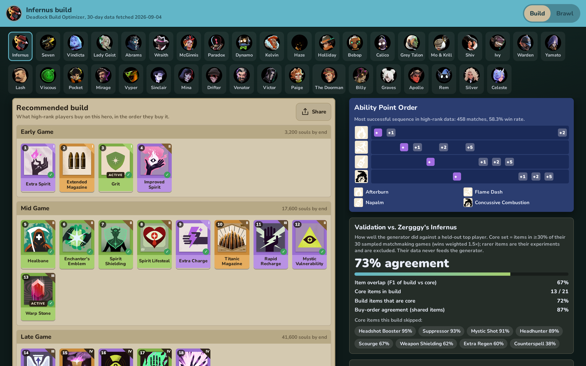

# Deadlock Build Optimizer 🔧

<p align="center">
  
</p>

Web app that generates an item build (items, buy order, ability level-up order)
for any [Deadlock](https://store.steampowered.com/app/1422450/Deadlock/) hero
from what high-rank players actually buy, using the public
[deadlock-api.com](https://deadlock-api.com) analytics. Each build is graded
against a held-out top player of that hero so you can see how close it lands.

It also has a **Street Brawl draft advisor**: it watches the draft screen,
recognises the three cards on offer, and tells you which to take and whether
to re-roll, in an always-on-top overlay or on your phone.

<p align="center">
  
</p>

## Quickstart 🚀

Requires Node ≥ 18.

```
git clone https://github.com/Gidntsquia/deadlock-build-optimizer
cd deadlock-build-optimizer
npm install
npm run fetch-data   # snapshots the API into public/data/ (~3 min, ~16 MB); needed after every fresh clone
npm run dev          # http://localhost:5173 — works offline after the fetch
```

Pick a hero and the build is there. For Street Brawl, flip the header switch
to **Brawl**, click **Capture game screen + overlay**, and pick the Deadlock
window. Run the game in borderless windowed mode so the overlay can sit on top;
in exclusive fullscreen use **Phone display** instead.

Other things you can do:

```
npm run generate [hero-id]   # print a hero's build in the terminal
npm run brawl -- --hero 1 --round 2 --owned "Extra Charge" --enemies "Lash,Seven" \
    --set "Improved Spirit,Enchanter's Emblem,Swift Striker"   # draft advice without the screen reader
npm run verify               # acceptance checks and the held-out scores
```

## Features 🔬

- One recommended build per hero (38 heroes), built from the last 30 days of
  Phantom+ lobbies where the data is deep enough, all ranks otherwise.
- Buy order and Early / Mid / Late grouping come from when players actually
  buy each item, not from cost.
- Ability point order is the highest-win-rate sequence in high-rank data.
- Every build is scored against a real top player's recent games
  (64–75 % agreement on the four held-out sets); the report card shows which
  core items were missed.
- Items past your usual final net worth are tagged **stretch**.
- Street Brawl advisor: screen capture → card recognition in a Web Worker →
  ranked picks, re-roll verdict, and your picks read back from the inventory
  grid. Nothing is sent to the game; only pixels are read.
- Always-on-top overlay (Chrome/Edge) or a phone display over
  [ntfy.sh](https://ntfy.sh) for exclusive fullscreen.
- Share a build as a PNG.
- No backend: Vite + React, everything runs from the fetched snapshot.

## Documentation 📚

Detailed documentation is in the
[wiki](https://github.com/Gidntsquia/deadlock-build-optimizer/wiki):

- [Data Pipeline](https://github.com/Gidntsquia/deadlock-build-optimizer/wiki/Data-Pipeline) — what `fetch-data` downloads, populations, rate limits
- [How the Build Generator Works](https://github.com/Gidntsquia/deadlock-build-optimizer/wiki/How-the-Build-Generator-Works) — the scoring function, buy order, ability order
- [Held-out Validation](https://github.com/Gidntsquia/deadlock-build-optimizer/wiki/Held-out-Validation) — the four top-player sets and the agreement metric
- [Street Brawl Advisor](https://github.com/Gidntsquia/deadlock-build-optimizer/wiki/Street-Brawl-Advisor) — card scoring, re-roll math, the CLI, the held-out check
- [Screen Reader](https://github.com/Gidntsquia/deadlock-build-optimizer/wiki/Screen-Reader) — how cards, labels, portraits and your picks are recognised
- [Overlay and Phone Display](https://github.com/Gidntsquia/deadlock-build-optimizer/wiki/Overlay-and-Phone-Display) — capture, Picture-in-Picture, ntfy.sh
- [Judgment Calls](https://github.com/Gidntsquia/deadlock-build-optimizer/wiki/Judgment-Calls) — every weight change and why, with the sweeps
- [Development](https://github.com/Gidntsquia/deadlock-build-optimizer/wiki/Development) — code layout, scripts, checks, visual design

## License 📄

[MIT](LICENSE). Game data and images come from [deadlock-api.com](https://deadlock-api.com)
at fetch time and are not distributed here.
